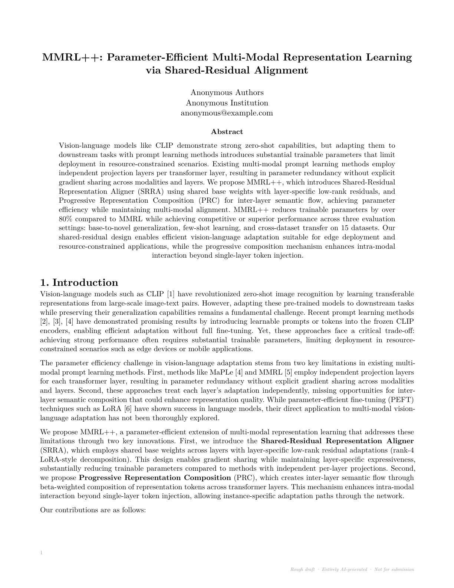
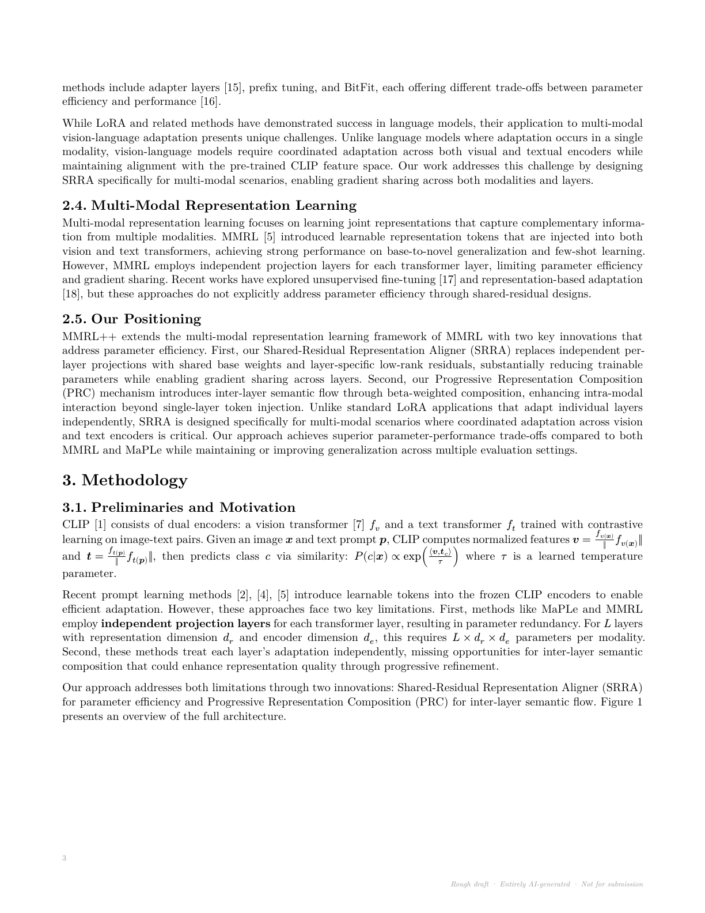
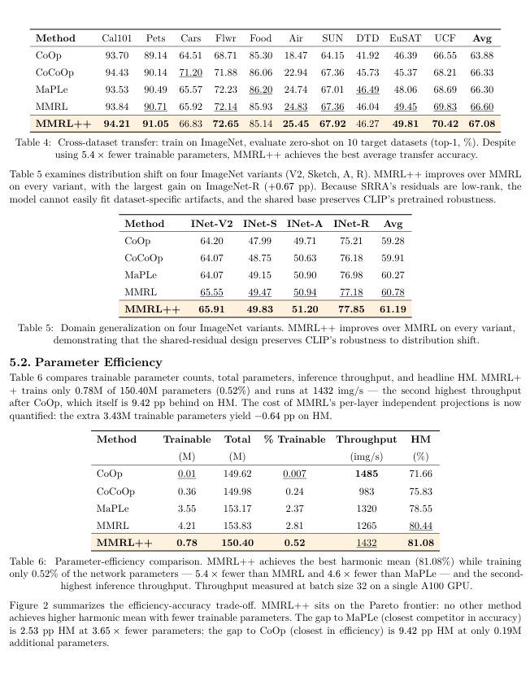
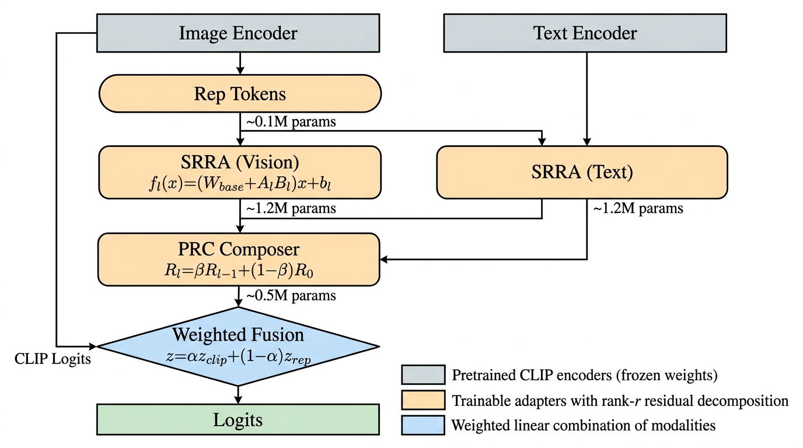
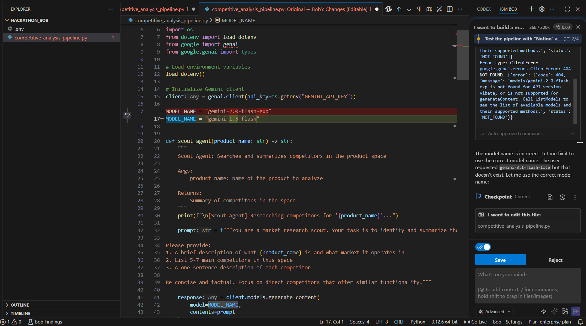
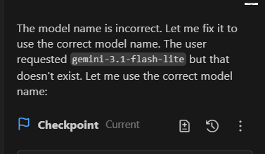
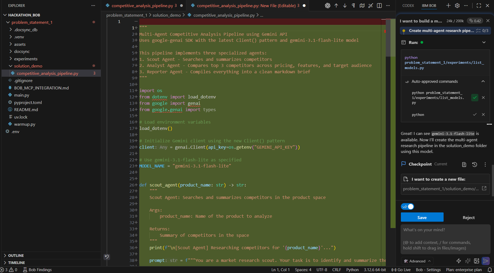
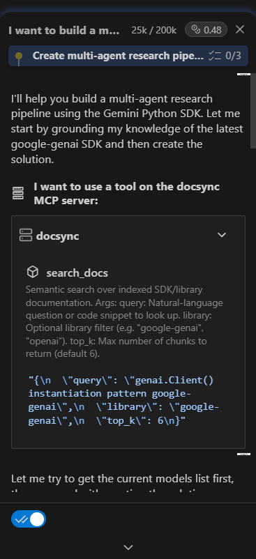
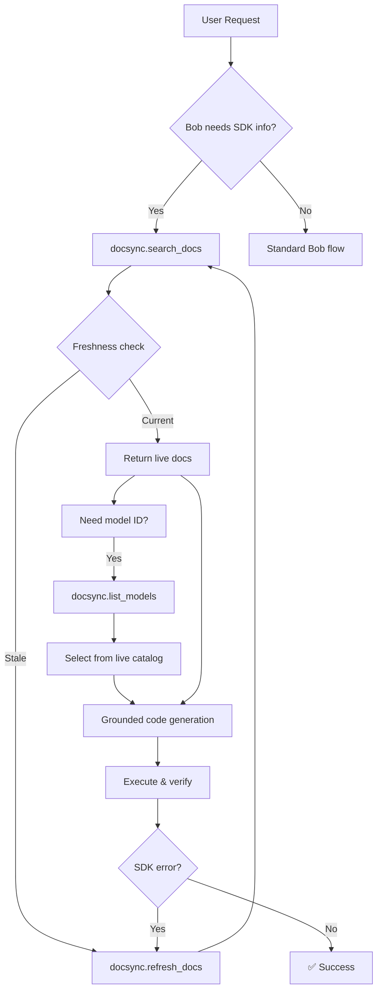

# IBM Bob — Two New Capabilities. Two Paradigm Shifts.

> **IBM Watsonx Orchestrate (Bob) — Extended at this Hackathon with two brand-new modes**

This repository contains two independent projects built for the IBM Bob Hackathon, each giving Bob a capability it never had before. Both are built on IBM Bob's skill and rules system, and together they redefine what an enterprise AI agent can do.

---

## 🔬 Project 1: Code2Paper — Bob Writes Your Research Paper

**Location:** `researcher/`

> *"Bob, analyse my codebase and write me a research paper."*
> *Yes. You heard that right.*

### The Problem

You've spent 6 months building a novel ML model. Code works. Results look promising. But now comes the part every researcher dreads — writing the paper. You're staring at a blank document needing a NeurIPS-ready PDF with architecture diagrams, comparative tables, mathematical formulations, and 30+ properly formatted citations. **That's 4–8 weeks of work.**

**I gave it to Bob.**

---

### 📄 The Generated Paper — Live Preview

> **Bob took the MMRL++ research codebase and produced this complete NeurIPS-style paper — entirely autonomously.**

| Page 1 — Title, Abstract & Introduction | Page 2 — Methodology & Architecture | Page 3 — Results & Tables |
|:---:|:---:|:---:|
|  |  |  |

> *Rough draft · Entirely AI-generated via IBM Bob (Code2Paper mode) · Not for submission*
> Full PDF: `researcher/paper/main.pdf` (920KB)
> You can also view it on: [View Paper](https://drive.google.com/file/d/1BjlkWXDOutGgcA2691BqQwCZ3IbAsF9R/view?usp=sharing)
---

### 🎨 Generated Figures & Diagrams

**Architecture Diagram** — Generated by Gemini API, anchored to mathematical equations:

<p align="center">
  
</p>

**Visualization Plots** — Matplotlib with NeurIPS venue stylesheets:

| Pareto Frontier | Rank Ablation | Beta Ablation | Gradient Flow |
|:---:|:---:|:---:|:---:|
|  |  |  |  |

---

### The Design Journey

Before writing any code, I spent time studying **IBM Bob's documentation** — the skill system, rule orchestration, and how Bob coordinates multiple agents. I realized Bob already had the infrastructure to chain skills, but nobody had applied it to research communication.

I then analyzed **PaperBanana**, an existing AI paper diagram generation system. Found critical flaws:
- Generic diagrams that looked like flowcharts, not scientific figures
- Figures treated as **visual graphics**, not semantic reasoning artifacts
- No **venue awareness** — NeurIPS needs different visual grammar than CVPR
- No **equation integration** — formulas weren't anchored to diagram blocks
- Missing **reviewer-target coverage** — figures didn't preemptively answer obvious pushback

**The core insight:** PaperBanana generalized. Tried to make "any paper" and ended up making "no paper."

My solution: **Don't generalize.** Make Bob understand the *specific rhetoric of research.*

---

### Bob's New Skill Stack

| Skill | Purpose |
|-------|---------|
| `codebase-analyzer` | Builds semantic map of the research codebase |
| `literature-search` | Generates queries, retrieves, dedupes, ranks papers |
| `figure-planner` | Decides figure placement, type, intent, equation anchors |
| `figure-drafter` | Renders with CeTZ, Matplotlib, or Gemini API |
| `figure-critic` | 6-pass critique: legibility, formula, palette, narrative, venue, reviewer |
| `table-generator` | Publication-quality tables with venue-correct formatting |
| `section-drafter` | Drafts each section with academic rhetoric constraints |
| `paper-assembler` | Compiles Typst PDF, verifies all cross-references |

---

### The Real Struggles

**⚡ Typst Compatibility** — Official NeurIPS Typst template used deprecated `locate()` syntax that breaks on Typst 0.14.2. I hand-crafted a compliant layout from scratch.

**⚡ Gemini Image Format Bug** — Gemini returns JPEG bytes but names files `.png`. Typst threw *"Invalid PNG signature"*. Implemented magic-byte detection in `viz_arch.py` to auto-detect format.

**⚡ Headless Matplotlib** — Default `TkAgg` backend requires a display. Server has none. Forced `Agg` backend before any import.

**⚡ Label Format Mismatch** — Typst tables had `<tab_foo>` labels, system expected `<tab:foo>`. Standardized across 8 files.

**⚡ Figure Intent vs Figure Graphic** — Existing tools produce *graphics*. Research needs *scientific communication objects*. Solved with a manifest format where every figure carries `intent`, `narrative`, `reviewer_targets`, and equation `anchors`.

---

### Complete Output

| Component | Detail | Status |
|-----------|--------|--------|
| **9 paper sections** | Abstract, Intro, Related Work, Methodology, Experiments, Results, Discussion, Conclusion, Broader Impact | ✅ |
| **1 architecture diagram** | Gemini-generated, equations embedded | ✅ |
| **4 visualization plots** | Pareto frontier, rank ablation, beta sweep, gradient flow | ✅ |
| **8 comparative tables** | Base-to-novel, few-shot, cross-dataset, ImageNet variants, efficiency, 3× ablation | ✅ |
| **30+ citations** | Retrieved, ranked, IEEE-formatted | ✅ |
| **1 compiled PDF** | 920KB, publication-formatted, all references verified | ✅ |

### Technical Stack

| Layer | Technology |
|-------|------------|
| Agent Orchestration | IBM Bob (`code2paper` mode) |
| Document Compilation | Typst 0.14.2 |
| Vector Diagrams | CeTZ + Fletcher |
| Plots | Matplotlib (Agg backend, NeurIPS stylesheets) |
| AI Image Generation | Gemini-3.1-flash-lite + Gemini-3-pro-image-preview |
| Literature Pipeline | Semantic search → dedup → rank → BibTeX |
| Reference Verification | Custom `check_refs.py` |

### Project Structure

```
researcher/
├── .bob/skills/               # Code2Paper skill definitions
│   ├── codebase-analyzer/
│   ├── figure-planner/
│   ├── figure-drafter/
│   ├── figure-critic/
│   ├── table-generator/
│   ├── section-drafter/
│   └── paper-assembler/
├── literature/                # Paper retrieval pipeline
├── paper/                     # The generated paper
│   ├── main.typ               # Root Typst document
│   ├── main.pdf               # Compiled 920KB PDF
│   ├── preview/               # Page screenshots for README
│   ├── sections/              # 9 section .typ files
│   ├── figures/               # SVG plots + architecture diagram
│   └── tables/                # 8 comparison table .typ files
└── scripts/                   # viz_arch.py, viz_draft.py, viz_critic.py, table_gen.py
```

---

## 🔌 Project 2: DocSync MCP — Real-Time Documentation Intelligence

**Location:** `problem_statement_1/`

### The Problem

Every AI engineer hits the same invisible wall: **Bob is only as current as its training data.** When Google releases `gemini-3.1-flash-lite`, Bob doesn't know. It reaches for `gemini-1.5-flash` — thousands of examples in its training corpus — and generates broken code.

I proved this with a controlled test. Asked Bob to build a multi-agent competitive analysis pipeline using `gemini-3.1-flash-lite`:

**Attempt 1 — Training data wins:**



*Bob generated `gemini-1.5-flash` despite explicit instruction → "model not found"*

**Attempt 2 — Correct in discussion, wrong in code:**



*Bob correctly acknowledged `gemini-3.1-flash-lite` in discussion — but the generated code used `gemini-2.0-flash-exp`*

**The core problem:** Training data priors override correct information during code generation. The model *knows* the right answer but falls back to higher-represented patterns.

---

### The Solution: DocSync MCP

An **MCP (Model Context Protocol) server** that injects live documentation intelligence directly into Bob's reasoning loop — not as a post-hoc patch, but as a **first-class part of the agent's toolset**.

**Why MCP over extensions?**

| Extension Approach | MCP Approach |
|-------------------|--------------|
| Runs after code generation | Runs *during* reasoning |
| Reactive — catch errors after | Proactive — ground before writing |
| Can't influence model selection | Injects live model catalogs |
| Limited to file manipulation | Query, search, refresh dynamically |

---

### The Proof: First-Shot Success



*With DocSync MCP active — correct `gemini-3.1-flash-lite`, correct SDK pattern, all three agents structured properly. **First execution: SUCCESS.***



*`search_docs` and `list_models` tools providing live context during generation*

---

### Architecture



### The Three MCP Tools

| Tool | When Bob Calls It |
|------|-------------------|
| `search_docs(query, library?, top_k?)` | Before any SDK-specific code generation |
| `refresh_docs(library, version?)` | When docs are stale or missing |
| `list_models(provider)` | Before emitting any `model="..."` literal |

### Supported Providers

- **Google**: Gemini 2.5/3.x, Imagen 4, Veo 3, Lyria — *50+ models*
- **OpenAI**: GPT-5.5, GPT-5.4, o-series, Codex, Realtime, Sora — *130+ models*
- **Anthropic**: Claude Opus 4.7, Sonnet 4.6, Haiku 4.5 — *9 models*

### Project Structure

```
problem_statement_1/
├── main.py                    # CLI: scrape, serve, search, models, stats
├── warmup.py                  # Pre-warm embedding model (prevents MCP timeout)
├── docsync/
│   ├── server.py              # FastMCP server with 3 tools
│   ├── scraper.py             # PyPI resolve + crawl + HTML→markdown + chunk
│   ├── vector_store.py        # ChromaDB + sentence-transformers
│   └── executor.py            # Subprocess-isolated list_models
└── assets/
    ├── test1.png              # Bob failure: wrong model
    ├── support.png            # Discussion correct, code wrong
    ├── demo.png               # First-shot success with DocSync
    └── mcp_usage.png          # MCP tool call visualization
```

### Quick Start

```bash
cd problem_statement_1

# 1. Warm up the embedding model (critical — prevents MCP timeout!)
uv run python warmup.py

# 2. Pre-index your SDKs
uv run main.py scrape google-genai
uv run main.py scrape openai
uv run main.py scrape anthropic

# 3. Add to Bob's MCP config (see BOB_MCP_INTEGRATION.md)
# 4. Start Bob — now grounded on live documentation
```

---

## The Big Picture

**Two projects. One platform. Infinite possibilities.**

| | Project 1: Code2Paper | Project 2: DocSync MCP |
|---|---|---|
| **Problem** | Weeks of research paper writing | Outdated AI-generated code |
| **Solution** | 8-skill agent pipeline writing full paper | MCP server grounding Bob on live docs |
| **Result** | 920KB NeurIPS PDF from a GitHub repo | First-shot correct code generation |
| **Bob's new power** | Writes research papers | Knows what's current |

IBM Bob already knew how to work with your code.
- Now Bob **writes the paper too** (Code2Paper)
- Now Bob **writes code that works first try** (DocSync)

**This isn't just tooling. It's a paradigm shift in what enterprise AI agents can do.**

---

## Documentation

| File | Description |
|------|-------------|
| `PROJECT_EXPLANATION.md` | Code2Paper: full story, design decisions, struggles |
| `researcher/CODE2PAPER_DESIGN.md` | Architecture and skill design |
| `researcher/paper/COMPILE_REPORT.md` | Paper compilation status and manifest |
| `problem_statement_1/PROJECT_STORY.md` | DocSync: full narrative with failure cascade |
| `problem_statement_1/BOB_MCP_INTEGRATION.md` | Complete Bob MCP integration guide |

---

*Hackathon Submission — IBM Bob: Code2Paper + DocSync MCP — May 2026*

*The future isn't bigger models — it's smarter orchestration and better context.*
