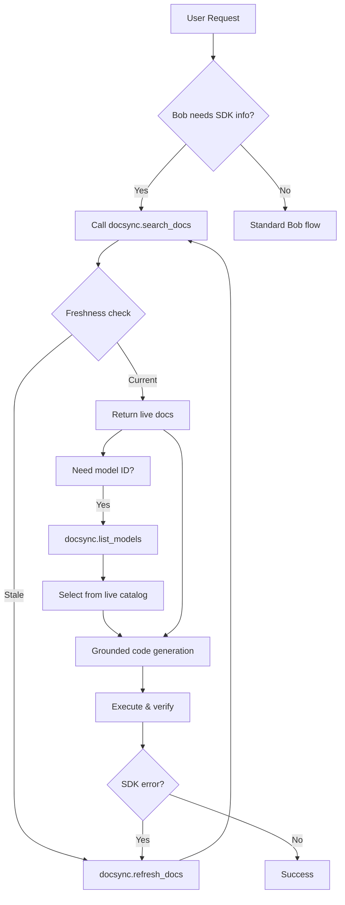
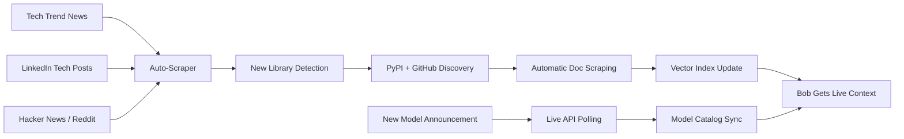

# DocSync MCP: Why Your AI Agent Is Only As Current As Its Training Data

## The Invisible Problem Every AI Engineer Faces

> *"Any agent — Bob, Cursor, Claude Code — is only as current as the LLM underneath it."*

Training takes **months**. AI SDKs ship breaking changes **weekly**. Model names change faster than any training pipeline can capture. This isn't a Bob problem. It's a **structural gap** between how LLMs are built and how fast the AI ecosystem moves.

Modern software development is increasingly powered by AI coding assistants. Developers rely on tools that can generate code, explain repositories, automate integrations, and accelerate engineering workflows. But as AI ecosystems evolve rapidly, a critical reliability gap has emerged.

**The hard truth:**
- Frameworks, SDKs, APIs, and model ecosystems now change faster than foundation models can be retrained
- New AI models, orchestration frameworks, and agentic architectures are introduced almost every week
- While coding assistants are highly capable at reasoning and code generation, they still frequently rely on historically dominant implementation patterns from their training data

This creates a real-world engineering problem:
- ❌ Outdated SDK usage
- ❌ Deprecated API patterns  
- ❌ Obsolete model references
- ❌ Incorrect integration examples
- ❌ Migration inconsistencies across rapidly evolving ecosystems

Even when explicitly instructed to use recently released models or SDK versions, coding assistants may still generate implementations based on older patterns because those examples are more deeply represented in model priors.

This issue becomes especially significant in modern AI engineering workflows involving:
- 🤖 Agentic AI frameworks
- 🔌 MCP integrations
- 🔄 Orchestration systems
- ⚡ Rapidly evolving LLM APIs
- 🧪 Experimental SDK ecosystems

**The challenge is not a lack of reasoning capability. The challenge is maintaining alignment between real-time ecosystem evolution and static model knowledge.**

---

## The Controlled Test: Catching Bob in the Act

Before writing a single line of solution code, I gave Bob a controlled task designed to expose the problem:

> **The Prompt:**
> *"I want to build a multi-agent research pipeline using the Gemini Python SDK directly (no wrappers, no orchestration frameworks — just google-genai).*
> 
> *The use case: a competitive analysis agent system where a user drops in a product name (say, 'Notion') and the system automatically:*
> 
> *- A Scout Agent searches and summarizes what competitors exist in that space*
> *- A Analyst Agent picks the top 3 competitors and compares them across pricing, features, and target audience*  
> *- A Reporter Agent compiles everything into a clean markdown brief*
> 
> *Each agent should be a separate function that calls the Gemini API independently and passes context forward. **Use gemini-3.1-flash-lite as the model for all agents.** Use the latest google-genai SDK style (the newer genai.Client() instantiation pattern, not the old genai.configure() + genai.GenerativeModel() pattern).*
> 
> *Please generate the full working Python code for this pipeline. And for api use .env 'GEMINI_API_KEY' and execute and test those agents"*

**No other agents named. No ambiguity. I watched what it reached for — and documented it.**

---

## The Failure Cascade: What Actually Happened

### Attempt 1: Training Data Takes Over


*Figure 1: Bob's first attempt — generating `gemini-1.5-flash` despite explicit instructions to use `gemini-3.1-flash-lite`*

Despite the explicit instruction to use `gemini-3.1-flash-lite`, Bob's first code generation reached for `gemini-1.5-flash` — a model that existed in its training data with thousands of examples.

**The execution result:**
```
genai.Client() SDK returns: model not found
```

### Attempt 2: The Correction That Wasn't


*Figure 2: In discussion, Bob correctly acknowledges `gemini-3.1-flash-lite-preview-0515` — but look at the code it actually generated*

In agent discussion mode, Bob correctly identified:
- ✅ The newer SDK pattern: `genai.Client(api_key=...)`
- ✅ The correct model name: `gemini-3.1-flash-lite-preview-0515`

But in the **actual code generation**:
- ❌ Model used: `gemini-2.0-flash-exp`
- ❌ Still not the requested `gemini-3.1-flash-lite`

**This is the core problem:** Even when the LLM *knows* the right answer in conversation mode, the training data priors override it during code generation. The model falls back to patterns with higher representation in its training corpus.

---

## The Solution: DocSync MCP

I chose to build DocSync as an **MCP (Model Context Protocol) server** rather than a Bob extension because of a fundamental architectural insight:

> **Bob allows custom instructions at the agent level itself.**

This means I can inject DocSync's real-time documentation intelligence **directly into Bob's reasoning loop** through MCP tool calls — not as a post-hoc patch, but as a **first-class part of the agent's toolset**.

### Why MCP Over Extensions?

| Extension Approach | MCP Approach |
|-------------------|--------------|
| Runs after code generation | Runs *during* reasoning |
| Requires parsing generated code | Provides context *before* generation |
| Reactive (catch errors after) | Proactive (ground before writing) |
| Can't influence model selection | Can inject live model lists |
| Limited to file manipulation | Can query, search, refresh dynamically |

**MCP integration means:**
- Every SDK call is grounded in live documentation
- Model IDs come from live API responses, not training memory
- Code generation follows current patterns, not historical priors
- The agent *asks* DocSync before writing code

---

## The Proof: First-Shot Success with DocSync


*Figure 3: With DocSync MCP active, Bob generates the correct `gemini-3.1-flash-lite` model on the first attempt*

**What changed:**
- ✅ Correct model: `gemini-3.1-flash-lite`
- ✅ Correct SDK pattern: `genai.Client(api_key=os.environ["GEMINI_API_KEY"])`
- ✅ All three agents (Scout, Analyst, Reporter) properly structured
- ✅ First execution: **SUCCESS**


*Figure 4: DocSync MCP in action — `search_docs` and `list_models` tools providing live context*

---

## Technical Architecture

### How DocSync Works



### Core Components

```
problem_statement_1/
├── main.py                 # CLI entry: scrape, serve, search, models, stats
├── warmup.py               # Pre-warm embedding model (prevents MCP timeout)
├── pyproject.toml          # Dependencies: httpx, bs4, chromadb, mcp, etc.
├── README.md               # Quick start guide
├── BOB_MCP_INTEGRATION.md  # Full Bob integration guide + mode prompts
├── PROJECT_STORY.md        # This document
│
├── docsync/                # Core package
│   ├── __init__.py
│   ├── __main__.py         # `python -m docsync` -> MCP stdio server
│   ├── server.py           # FastMCP server with 3 tools
│   ├── scraper.py          # PyPI resolve + crawl + HTML→markdown + chunk
│   ├── vector_store.py     # ChromaDB + sentence-transformers (lazy loaded)
│   └── executor.py         # Subprocess-isolated list_models
│
├── .docsync_db/            # Local Chroma persistence (auto-created, gitignored)
│   └── ...                 # ~400MB embedding model cache + indexed docs
│
└── assets/                 # Documentation images
    ├── test1.png           # Bob failure: wrong model generation
    ├── support.png         # Bob discussion correct but code wrong
    ├── demo.png            # Bob success with DocSync
    └── mcp_usage.png       # MCP tool call visualization
```

### The Three MCP Tools

| Tool | Purpose | When Bob Calls It |
|------|---------|-------------------|
| `search_docs(query, library?, top_k?)` | Semantic search over indexed docs | Before any SDK-specific code generation |
| `refresh_docs(library, version?)` | Re-scrape & re-index a library | When docs are stale or missing |
| `list_models(provider)` | Live model catalog from provider API | Before emitting any `model="..."` literal |

### Supported Providers (Live Model Lists)

- **Google** (`google-genai`): Gemini 2.5/3.x series, Imagen 4, Veo 3, Lyria, Robotics-ER, Embedding 2, Deep Research previews — *50 models*
- **OpenAI**: GPT-5.5, GPT-5.4, Codex, Realtime, Audio, o-series, Sora, Search — *130 models*
- **Anthropic**: Claude Opus 4.7, Sonnet 4.6, Haiku 4.5, etc. — *9 models*

---

## The Integration: Making Bob Grounded

DocSync extends IBM Bob's repository-level contextual understanding with a **real-time documentation intelligence layer**:

### What DocSync Adds to Bob

1. **Continuous Documentation Ingestion**
   - Scrapes official SDK documentation via PyPI `project_urls`
   - Tracks API and framework updates automatically
   - Monitors changelogs and releases

2. **Freshness-Aware Retrieval**
   - Unlike traditional RAG (semantic similarity only), DocSync introduces **version-aware context ranking**
   - Prioritizes current and production-relevant implementations
   - Tags code blocks and changelog entries with higher priority

3. **Deprecation Detection**
   - Identifies deprecated implementations
   - Suggests modern integration patterns
   - Flags migration requirements

4. **Live Model Catalog Access**
   - Real-time model listing via provider SDKs
   - Never relies on training-time model knowledge
   - Handles model renames, deprecations, new releases

### Through MCP Integration

IBM Bob gains access to continuously updated ecosystem intelligence **while retaining its existing repository reasoning strengths**. The result:

- ✅ More current implementation patterns
- ✅ Reduced outdated code generation  
- ✅ Improved SDK compatibility
- ✅ Faster adaptation to evolving technologies
- ✅ Lower debugging and migration overhead

---

## Current Scope & Future Roadmap

### Current Implementation (Due to Bob 40 Coin Limit)

Due to resource constraints (Bob's 40 coin limit per session), the current DocSync implementation focuses on:

- **Core SDKs**: `google-genai`, `openai`, `anthropic`, `langchain`, `langgraph`
- **Manual scraping**: `uv run main.py scrape <library>`
- **On-demand refresh**: Triggered via `refresh_docs` tool when stale

### The Vision: Autonomous Ecosystem Awareness

Once scaling constraints lift, DocSync evolves into a **self-updating documentation intelligence system**:



### Phase 2: Autonomous Trend Detection

**Auto-Scraper Pipeline:**
- 🕷️ Crawl tech news sites (TechCrunch, The Verge AI, Ars Technica)
- 🔍 Monitor LinkedIn for new framework announcements
- 📡 Subscribe to Hacker News "Show HN" launches
- 📊 Track PyPI download trends for emerging packages

**Smart Library Discovery:**
- Detect mentions of new SDKs/orchestrators in code repositories
- Cross-reference with GitHub trending repositories
- Automatically identify documentation URLs
- Queue for scraping when confidence > threshold

**Continuous Synchronization:**
- Scheduled `refresh_docs` for tracked libraries
- Delta updates (only changed pages)
- Version-aware indexing (maintain docs for multiple SDK versions)
- Automatic model catalog polling for all providers

### Phase 3: The Self-Healing Agent

The ultimate goal: **Bob never generates outdated code again.**

- Before any code edit touching external SDKs → automatic `search_docs`
- Before any model literal → automatic `list_models`
- On SDK errors → automatic `refresh_docs` and retry
- New library detected in ecosystem → automatically indexed within hours

---

## Why This Matters

### The Cost of Outdated Code Generation

When an AI assistant generates code using deprecated patterns:

1. **Immediate failure**: Code doesn't run (model not found, API removed)
2. **Debugging time**: Developer spends 15-30 min investigating
3. **Context switching**: Developer leaves flow state
4. **Trust erosion**: Developer questions AI reliability
5. **Workaround accumulation**: Project fills with `# TODO: update when AI learns`

### The Value of Grounded Generation

With DocSync MCP:

1. **First-shot success**: Code runs on first execution
2. **Current patterns**: Uses latest SDK idioms
3. **Correct models**: Never references deprecated endpoints
4. **Faster iteration**: No debugging of hallucinated APIs
5. **Trust building**: Developer confidence in AI assistance

---

## Conclusion: Closing the Gap

DocSync MCP addresses one of the most important problems in AI-assisted development: **the structural mismatch between static model knowledge and dynamic ecosystem evolution.**

IBM Bob already excels at repository-level contextual understanding — analyzing real codebases, understanding architecture, reasoning across files. DocSync extends that capability with **real-time ecosystem intelligence** through MCP integration.

The result is an AI coding assistant that:
- Understands your codebase (Bob's existing strength)
- Understands the current state of external SDKs (DocSync's contribution)
- Generates code that works on the first try (the combined result)

**This isn't just a tool. It's a paradigm shift in how AI agents stay current.**

---

## Quick Start for Bob Users

```powershell
# 1. Warm up the embedding model (critical!)
cd D:\gowtham-projects\hackathon_bob\problem_statement_1
uv run python warmup.py

# 2. Pre-index your commonly used SDKs
uv run main.py scrape google-genai
uv run main.py scrape openai
uv run main.py scrape anthropic
uv run main.py scrape langchain

# 3. Add to Bob's MCP config (see BOB_MCP_INTEGRATION.md for full config)
# 4. Start Bob — now grounded on live documentation
```

---

## Files Reference

| File | Purpose |
|------|---------|
| `BOB_MCP_INTEGRATION.md` | Complete integration guide with augmented mode prompts for Plan, Code, Advanced, Ask, Orchestrator |
| `README.md` | Quick start and technical overview |
| `PROJECT_STORY.md` | This document — the narrative and motivation |
| `warmup.py` | Pre-warm script to prevent MCP timeouts |
| `main.py` | CLI for scraping, serving, searching, model listing |

---

*Built for Bob. Built for every developer tired of debugging AI-generated outdated code.*

*The future of AI coding assistance is not bigger models — it's better context.*
