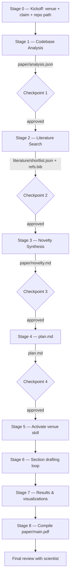

# Code2Paper — A Bob Custom Mode for Turning Codebases into Publishable Papers

> *"Daily, new agents and research drop. The scientist can't keep up with the pace of writing the very papers their work deserves. Code2Paper is the bench-mate that takes a working codebase and walks the scientist, stage by stage, to a venue-ready Typst manuscript — without ever fabricating a number or a citation."*

This project ships as a **Bob custom mode** + a curated set of **Bob skills**.
It deliberately does **not** use MCP — heavy embedding loads and long search
waterfalls would trip MCP's request timeout (we hit this with DocSync). Instead
everything runs through Bob's `command` tool and Python helpers in this repo.

---

## 1. Paste-ready: Bob "Create new mode" form

Open Bob → Settings → Modes → **+ Create new mode** and paste the values below.

| Field | Value |
|------|-------|
| **Slug** | `code2paper` |
| **Name** | `📜 Code2Paper` |
| **Description** | Convert a working research codebase into a publication-ready Typst paper (NeurIPS / CVPR / IEEE / Springer) through a strict, checkpoint-gated, multi-agent workflow. |
| **Scope** | **Project** (lives at `.bob/custom_modes.yaml`). Use Global only if you want the same workflow across all projects. |
| **Role definition** | *(see below — also in `.bob/custom_modes.yaml`)* |
| **When to use** | Use Code2Paper when a scientist has a working codebase (model architecture, training/evaluation scripts, results) and needs to produce a venue-ready research paper. Ideal for turning AI/ML research repositories into NeurIPS, CVPR, ICML, IEEE, or Springer submissions. **Not for** blog posts, README files, or general technical writing — for those use Code or Ask mode. |
| **Custom Instructions** | Follow the multi-stage Code2Paper workflow defined in `.bob/rules-code2paper/`. Always operate in stages with explicit human checkpoints. Never skip the novelty discussion or the `plan.md` approval. When invoking literature search or visualization generation, use the project skills — never reinvent them. Output Typst files only into `paper/`, never overwrite the codebase. |
| **Available Tools** | ☑ Read files, ☑ Edit files (restricted to `paper/`, `.bob/`, `plan.md`, `results/*.json|csv`, `literature/*.json`), ☑ Execute commands, ☑ Use skills, ☑ Use browser. *Disable MCP — see note below.* |

### Role definition (full text)

> You are Bob in Code2Paper mode — a research engineer and scientific writing partner specialized in transforming a working codebase into a publication-ready research paper. You are exceptionally rigorous about scientific honesty: every empirical claim must trace to an executed run, every related-work claim must trace to a real, retrieved citation, and every figure must be reproducible from code in the repository.
>
> You collaborate with a literature-search agent and a visualization-critic agent that live as Python skills inside this project. You orchestrate them; you alone write the Typst manuscript. You never invent results. You never fabricate citations. When information is missing, you stop and ask the scientist.
>
> You write in Typst (not LaTeX) and target conference-specific templates (NeurIPS, CVPR, IEEE, Springer/Lecture Notes) selected via project skills.

### Why no MCP?

Code2Paper does heavy work that MCP's stdio transport handles poorly:

- Sentence-transformer embeddings (~400MB model load).
- Federated literature searches across 9 sources (10–60s of HTTP I/O).
- Long experiment runs from `results-runner` (minutes to hours).

All of this would either trip MCP's default 60s request timeout or block the
client UI. Skills + `command` tool is the right primitive: Bob spawns each
job as a normal subprocess, streams logs, and never fights a timeout.

---

## 2. Project layout

```
researcher/
├── .bob/
│   ├── custom_modes.yaml                 # The mode (paste-ready)
│   ├── rules-code2paper/                 # Mode-specific rules (loaded automatically)
│   │   ├── 01-workflow.md                #   8-stage workflow with checkpoints
│   │   ├── 02-checkpoints.md             #   Approval protocol
│   │   └── 03-agent-protocol.md          #   Inter-agent JSON contract & discipline
│   └── skills/
│       ├── codebase-analyzer/SKILL.md
│       ├── literature-search/SKILL.md
│       ├── novelty-finder/SKILL.md
│       ├── plan-writer/{SKILL.md, plan-template.md}
│       ├── section-drafter/SKILL.md
│       ├── results-runner/SKILL.md
│       ├── visualization-generator/SKILL.md
│       ├── typst-neurips/{SKILL.md, template.typ}
│       ├── typst-cvpr/{SKILL.md, template.typ}
│       ├── typst-ieee/{SKILL.md, template.typ}
│       └── typst-springer/{SKILL.md, template.typ}
│
├── literature/                           # Federated search package
│   ├── __init__.py
│   ├── models.py                         # Paper dataclass
│   ├── search.py                         # CLI: -m literature.search
│   ├── dedupe.py                         # CLI: -m literature.dedupe
│   ├── rank.py                           # CLI: -m literature.rank (sentence-transformers)
│   ├── to_bibtex.py                      # CLI: -m literature.to_bibtex
│   ├── verify_bib.py                     # CLI: -m literature.verify_bib
│   ├── verify_numbers.py                 # CLI: -m literature.verify_numbers
│   ├── aggregate_results.py              # CLI: -m literature.aggregate_results
│   └── sources/
│       ├── _base.py                      # BaseSearcher with safe_search()
│       ├── arxiv_source.py               # arXiv — keyless
│       ├── crossref_source.py            # CrossRef — keyless
│       ├── scholarly_source.py           # OpenAlex (Scholar stand-in) — keyless
│       ├── ncbi_pubmed.py                # NCBI E-utilities — keyless
│       ├── core_api.py                   # CORE — needs CORE_API_KEY
│       ├── ieee.py                       # IEEE Xplore — needs IEEE_API_KEY
│       ├── elsevier.py                   # Scopus — needs ELSEVIER_API_KEY
│       ├── springer.py                   # Springer Meta + OA — needs SPRINGER_API_KEY
│       └── wiley.py                      # Wiley via CrossRef-Wiley filter — needs WILEY_TDM_TOKEN
│
├── scripts/
│   ├── viz_draft.py                      # matplotlib draft renderer
│   └── viz_critic.py                     # Heuristic critic (swap for nano-banana)
│
├── paper/                                # All paper artifacts (Bob's writable area)
│   ├── analysis.json                     # produced by codebase-analyzer
│   ├── novelty.md                        # produced by novelty-finder
│   ├── refs.bib                          # produced by literature.to_bibtex
│   ├── queries.json                      # produced by Bob (for literature search)
│   ├── main.typ                          # initialized by venue skill
│   ├── sections/*.typ                    # Bob writes section bodies here
│   └── figures/                          # SVG/PDF figures + spec.json + critique.json
│       └── _style.mplstyle
│
├── literature/raw/                       # raw search hits, gitignored
├── literature/shortlist.json             # ranked top-N
├── results/                              # experiment outputs + _index.json
├── experiments/                          # results-runner writes scripts here
├── plan.md                               # the contract document — scientist edits
└── pyproject.toml
```

The `fileRegex` on the `edit` tool is set so Bob can **only** edit:

```
^(paper/.*|\.bob/.*|plan\.md|results/.*\.json|results/.*\.csv|literature/.*\.json)$
```

The codebase under analysis stays read-only, except via `results-runner` which
explicitly asks for approval before adding `experiments/<exp_id>.py`.

---

## 3. The 8-stage workflow



Each checkpoint is a **hard stop** — Bob waits for the scientist to type
"approved" or to edit the artifact directly. See
`.bob/rules-code2paper/02-checkpoints.md`.

---

## 4. Skills inventory

| Skill | Reads | Writes | When activated |
|-------|-------|--------|----------------|
| `codebase-analyzer` | source tree | `paper/analysis.json` | Stage 1 |
| `literature-search` | `paper/queries.json` | `literature/raw/`, `literature/shortlist.json`, `paper/refs.bib` | Stage 2 |
| `novelty-finder` | analysis + literature | `paper/novelty.md` | Stage 3 |
| `plan-writer` | analysis + novelty | `plan.md` | Stage 4 |
| `typst-neurips` / `typst-cvpr` / `typst-ieee` / `typst-springer` | plan | `paper/main.typ`, `paper/sections/` skeleton | Stage 5 (one of) |
| `section-drafter` | everything in `paper/` | `paper/sections/*.typ` | Stage 6 |
| `results-runner` | source tree | `results/*.json`, `experiments/<id>.py` | Stage 7 (if gaps) |
| `visualization-generator` | results + plan | `paper/figures/*` | Stage 7 |

---

## 5. Inter-agent communication contract

All inter-agent artifacts are JSON with a strict envelope (see
`.bob/rules-code2paper/03-agent-protocol.md`):

```json
{
  "agent": "literature-search | novelty-finder | visualization-generator | results-runner",
  "stage": 2,
  "produced_at": "ISO-8601",
  "inputs":  ["paper/queries.json"],
  "outputs": ["literature/raw/arxiv.json"],
  "status":  "ok | partial | failed",
  "notes":   "..."
}
```

Bob is the **only writer of Typst**. Other agents emit JSON or markdown; Bob
translates into `.typ`. This keeps the manuscript voice consistent and
prevents agents from stepping on each other's prose.

### Two non-negotiable disciplines

1. **Citation discipline** — every `#cite(<key>)` in `.typ` must resolve in
   `paper/refs.bib`. Enforced by `uv run python -m literature.verify_bib`.
2. **Numerical claim discipline** — every number in
   `paper/sections/results.typ` must come from `results/_index.json` and be
   followed by a Typst comment `// src: results/_index.json#<exp>.<metric>@<commit>`.
   Enforced by `uv run python -m literature.verify_numbers`.

---

## 6. Literature search — sources

Inspired by [AutoResearchClaw](https://github.com/aiming-lab/AutoResearchClaw/tree/main/researchclaw/literature).
All searchers implement `search(query, max_results) -> list[Paper]` and
gracefully no-op when their key is missing.

| Source | API | Key env var | Notes |
|--------|-----|-------------|-------|
| arXiv | OAI/Atom export | — | Best for AI/ML |
| CrossRef | REST | — | Universal DOI metadata |
| OpenAlex | REST | — | Stand-in for Scholar; abstracts via inverted index |
| NCBI PubMed | E-utilities | optional `NCBI_API_KEY` | Bio/medical papers |
| CORE | REST | `CORE_API_KEY` (free) | OA full-text aggregate |
| IEEE Xplore | REST | `IEEE_API_KEY` | Hardware/EE/CS systems |
| Elsevier (Scopus) | REST | `ELSEVIER_API_KEY` | Broad index, citations |
| Springer Meta | REST | `SPRINGER_API_KEY` | LNCS, journals |
| Springer OA | REST | `SPRINGER_API_KEY` | Open-access subset |
| Wiley | CrossRef filter | `WILEY_TDM_TOKEN` | Metadata-safe |

Ranking: `score = 0.5·relevance + 0.3·recency + 0.2·log(citations+1)` — see
`literature/rank.py`. Embedding model:
`sentence-transformers/all-MiniLM-L6-v2`, downloaded once, reused thereafter.

---

## 7. Typst venue skills

Code2Paper writes Typst, not LaTeX. Why:

- Faster compile loop (sub-second on a typical paper).
- Modern programmatic figures via `cetz` (architecture diagrams).
- Cleaner template package ecosystem at https://typst.app/universe.

Bob's mode picks **one** of these skills based on the venue chosen at Stage 0:

- `typst-neurips`  → [`bloated-neurips`](https://typst.app/universe/package/bloated-neurips/)
- `typst-cvpr`     → [`blind-cvpr`](https://typst.app/universe/package/blind-cvpr/)
- `typst-ieee`     → [`charged-ieee`](https://typst.app/universe/package/charged-ieee/)
- `typst-springer` → [`springer-spaniel`](https://typst.app/universe/package/springer-spaniel/)

Each skill ships its own `template.typ` boilerplate that Bob copies to
`paper/main.typ` and parameterizes from `plan.md`.

---

## 8. Visualization — draft + critic loop

Following [PaperBanana](https://github.com/dwzhu-pku/PaperBanana)'s philosophy:
**figures must be unique to the paper's story.**

Workflow:

1. Bob writes `paper/figures/<id>.spec.json` (with `narrative`, `viz_type`,
   `axes`, `groups`, `highlight`, `constraints`).
2. `scripts/viz_draft.py` renders an SVG from the spec + the data file.
3. `scripts/viz_critic.py` checks the SVG against constraints (font sizes,
   highlight visibility, narrative grounding) and emits a `critique.json`.
4. Loop until critique status is `ok` or scientist overrides with `--accept`.
5. Bob inserts `#figure(image("figures/<id>.svg"), caption: [...]) <fig:id>`.

The critic is currently a deterministic heuristic so it works offline. To
upgrade to a multimodal LLM critic (e.g., Gemini 3 Pro Vision / Claude Sonnet
4.6), swap the body of `critique()` in `scripts/viz_critic.py`.

---

## 9. Setup

```powershell
cd d:\gowtham-projects\hackathon_bob\researcher
uv sync
# optional: API keys for paid sources
echo IEEE_API_KEY=...      >> .env
echo ELSEVIER_API_KEY=...  >> .env
echo SPRINGER_API_KEY=...  >> .env
echo CORE_API_KEY=...      >> .env

# verify the search pipeline
uv run python -c "from literature.sources import ArxivSearcher; print(len(ArxivSearcher().search('vision transformer', 5)))"
```

Then in Bob:

1. Settings → Modes → **+ Create new mode** with the values from §1.
   *(Or Bob will pick up `.bob/custom_modes.yaml` automatically on next start.)*
2. Open the codebase you want to write a paper about as the current project.
3. Switch to `📜 Code2Paper` mode.
4. Bob greets you as **scientist** and asks the three Stage-0 questions.

---

## 10. Why this works

- **Hard checkpoints** prevent the runaway hallucinated-paper failure mode.
- **Citation + number discipline** make scientific honesty mechanically
  enforceable, not aspirational.
- **One writer of Typst** keeps voice consistent; agents pass JSON, not prose.
- **Skills not MCP** sidesteps the request-timeout cliff that DocSync hit.
- **Typst not LaTeX** gives the scientist a sub-second compile loop and a
  rich diagram language for free.

The end product is a `paper/main.pdf` whose every claim either runs from
this repository, or cites a paper that exists in `paper/refs.bib`.

---

## 11. Roadmap

- **Architecture diagrams** as a dedicated `cetz-diagrams` skill (currently
  hand-written into methodology.typ).
- **Multimodal critic** — replace the heuristic in `viz_critic.py` with
  Gemini-3-Pro-Vision or Claude-Opus-4.7 over an image.
- **Reviewer-2 pre-flight** — a "Reviewer Bob" sub-mode that reads `main.pdf`
  and predicts likely rejection reasons.
- **Camera-ready helper** — diff-aware editor for addressing reviewer comments.
